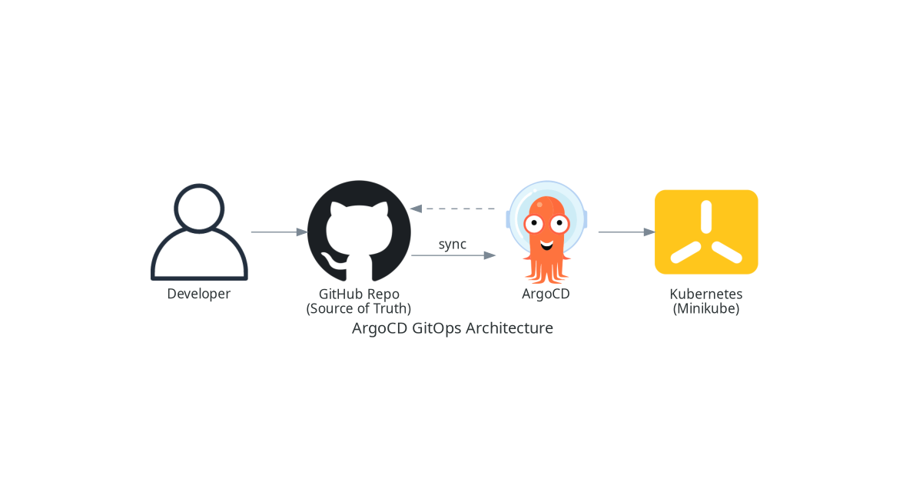
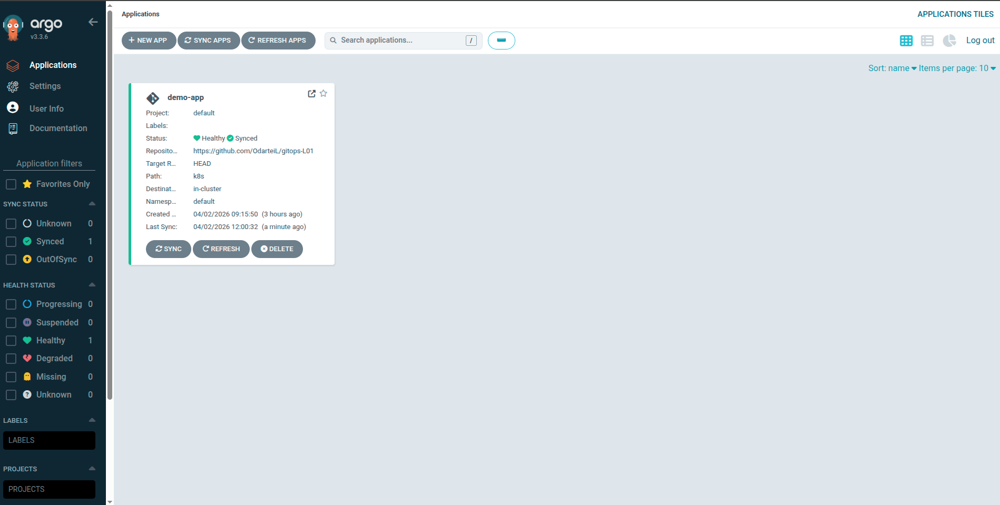
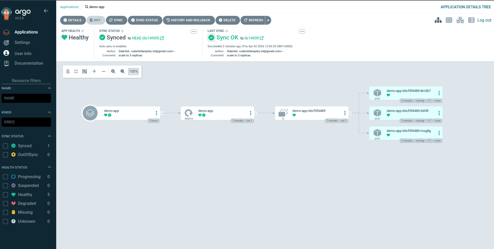

# Lab 01 — GitOps with ArgoCD on KIND

A complete GitOps workflow where every commit to this repository automatically triggers a Kubernetes deployment via ArgoCD running on a local KIND cluster.

## The GitOps Loop

```
commit → detect → sync → deploy
```

## Stack

- **KIND** — local Kubernetes cluster running in Docker
- **ArgoCD v3.3.6** — GitOps continuous delivery engine
- **GitHub** — single source of truth for cluster state

---

## Architecture



---

## What Was Built

### 1. KIND Cluster
A local Kubernetes cluster was created using KIND (Kubernetes IN Docker) as a lightweight alternative to Minikube.

### 2. ArgoCD Installation
ArgoCD was installed into the `argocd` namespace using the official manifest and accessed via `kubectl port-forward`.

### 3. GitOps Application
An ArgoCD `Application` resource was created pointing to this repository (`k8s/` path) with automated sync, pruning, and self-healing enabled.

### 4. Live Reconciliation
A commit changing `replicas: 1` to `replicas: 3` was pushed to GitHub. ArgoCD detected the change and automatically synced the cluster — no `kubectl apply` was run manually.

---

## Proof of Work

### ArgoCD Dashboard — Application Healthy & Synced
The `demo-app` application is shown as **Healthy** and **Synced**, connected to this GitHub repository tracking the `k8s/` path at `HEAD`.



### ArgoCD Application Tree — 3 Pods Running
After pushing the `scale to 3 replicas` commit, ArgoCD synced to commit `0c14939` and the deployment tree shows 3 pods all in **Running** state.



---

## Repository Structure

```
.
├── k8s/
│   └── deployment.yaml       # Desired state — watched by ArgoCD
├── screenshots/
│   ├── argocd_1.png          # ArgoCD dashboard showing Healthy + Synced
│   └── argocd_2.png          # App tree showing 3 running pods
├── architecture_diagram.png  # GitOps architecture diagram
├── architecture_diagram.py   # Diagram generation script
├── GUIDE.md                  # Full step-by-step walkthrough
└── README.md
```

---

## Guide

See [GUIDE.md](./GUIDE.md) for the full step-by-step walkthrough with command explanations.
